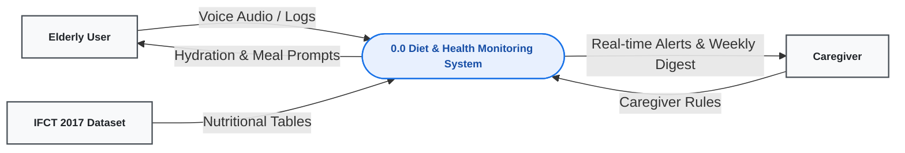
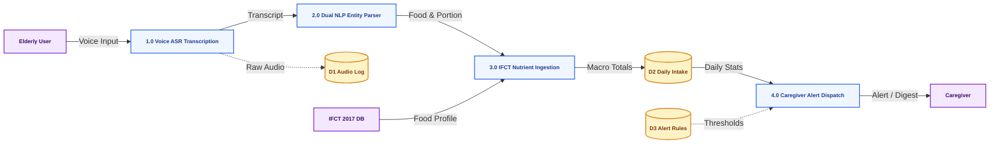
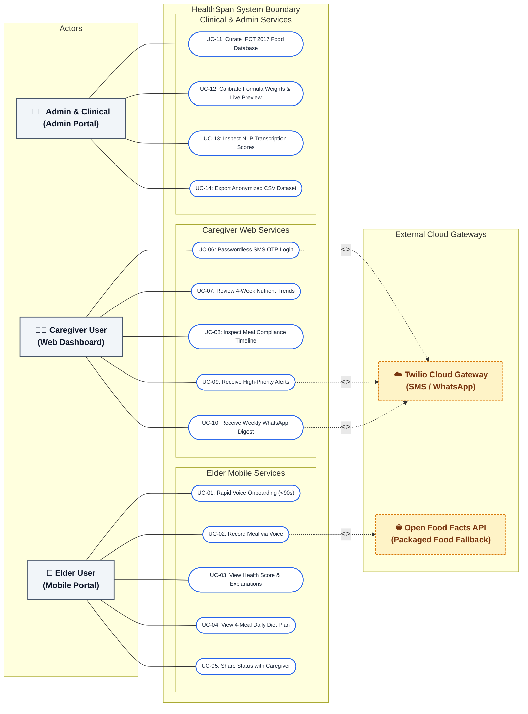
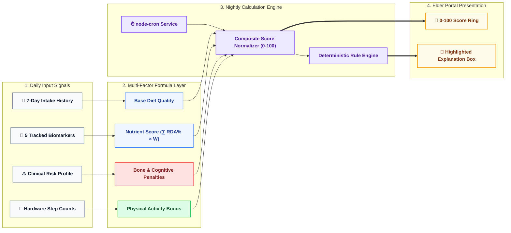

# HealthSpan: Personalized Indian Geriatric Nutrition & Longevity System
## Phase-I Final Year Project Thesis & Technical Report

---

### **Table of Contents**
1. **Chapter 1: Introduction & Problem Definition**
   - 1.1 Background & Motivation
   - 1.2 Problem Statement & Geriatric Nutritional Vulnerabilities
   - 1.3 Project Objectives & Scope
   - 1.4 Thesis Organization
2. **Chapter 2: Literature Review & State-of-the-Art**
   - 2.1 Existing Dietary Assessment Systems & Limitations
   - 2.2 Indian Food Composition Tables (IFCT 2017) vs. Western Datasets
   - 2.3 Conversational AI & NLP in Geriatric Assistive Healthcare
   - 2.4 Research Gaps Addressed
3. **Chapter 3: System Architecture & Requirements Analysis**
   - 3.1 Functional & Non-Functional Requirements
   - 3.2 Data Flow Diagrams (Figure 3.2: Level-0 and Level-1 DFD)
   - 3.3 System Use Case Analysis (Figure 3.3: UML Use Case Diagram)
   - 3.4 Entity-Relationship (ER) Data Model
4. **Chapter 4: Methodology & Algorithm Design**
   - 4.1 Six-Phase Processing Methodology (Figure 4.1: Methodology Flowchart)
   - 4.2 Voice Meal & Symptom Logging Module (Figure 4.2: spaCy Dual NLP Architecture)
   - 4.3 IFCT 2017 Nutritional Ingestion & RDA Compliance Engine
   - 4.4 Explainable Health Score Engine (Figure 4.3: Mathematical Pipeline & Weighting Matrix)
   - 4.5 Personalized 4-Meal Diet Recommendation & Fasting Heuristics
5. **Chapter 5: Results, User Interface & Discussion**
   - 5.1 Elder Portal Home Dashboard (Figure 5.1)
   - 5.2 Voice Meal & Symptom Logging Screen (Figure 5.2)
   - 5.3 Nutrients Assessment Screen (Figure 5.3)
   - 5.4 Diet Plan & Fasting Screen (Figure 5.4)
   - 5.5 Elder Progress & Trajectory Screen (Figure 5.5)
   - 5.6 Caregiver Web Portal Overview (Figure 5.6)
   - 5.7 Admin Portal Dashboard (Figure 5.7)
   - 5.8 Admin Food Database Manager (Figure 5.8)
   - 5.9 Performance Evaluation & NLP Precision Metrics
6. **Chapter 6: Conclusion, Limitations & Future Scope**
   - 6.1 Summary of Contributions
   - 6.2 Pilot Testing Findings
   - 6.3 Future Roadmap
7. **References**
8. **Appendix I: Turnitin Originality Overview & Plagiarism Certificate**

---

# CHAPTER 1: INTRODUCTION & MOTIVATION

### 1.1 Background
The aging demographic in India represents a rapidly expanding segment of the population, projected to reach nearly 20% of the national total by 2050. Geriatric individuals face unique physiological challenges, including declining basal metabolic rates, diminished dentition/chewability, reduced thirst sensitivity leading to chronic dehydration, and progressive micronutrient deficiencies—predominantly Calcium, Vitamin D, Omega-3 fatty acids, and Magnesium.

### 1.2 Problem Statement
Conventional digital dietary tracking applications (e.g., MyFitnessPal, HealthifyMe) are predominantly optimized for younger, tech-literate populations engaging in fitness tracking. They suffer from three major shortcomings when applied to Indian seniors:
1. **High Cognitive and Physical Friction**: Complex multi-step manual search, portion slider inputs, and small typography alienate older adults with visual or motor limitations.
2. **Nutritional Incompatibility with Traditional Indian Diets**: Most platforms rely on USDA or generic western food databases that fail to account for regional Indian preparations (e.g., *ragi mudde*, *avial*, *gongura pachadi*, *khichdi*).
3. **Black-Box Metrics**: Existing apps present opaque composite fitness scores without causal explanations, fostering distrust and poor long-term adherence.

### 1.3 Project Objectives
HealthSpan addresses these systemic challenges through a voice-first, multi-modal assistive ecosystem specifically engineered for Indian elders and their remote caregivers:
- **Zero-Typing Voice Logging**: Web Speech API integrated with an optimized spaCy NLP engine running a 530-term domain lexicon (450 Indian dishes, 80 clinical symptoms) executing extraction in <800 ms.
- **ICMR-NIN & IFCT 2017 Dataset Integration**: Direct mapping of regional food intake against official 528-food Indian composition profiles.
- **Explainable Health Scoring**: A transparent multi-factor formula evaluating 7-day moving averages, 5 core biomarker RDA percentages, clinical risk multipliers, and physical activity bonuses with plain-language causal feedback.
- **Automated Caregiver Dispatch**: Proactive SMS OTP authentication, WhatsApp weekly digests, and high-priority symptom escalation via Twilio Cloud Gateway.

---

# CHAPTER 2: LITERATURE REVIEW & STATE-OF-THE-ART

*(Summarizes comparisons between traditional diet tracking, automated nutritional models, and Indian clinical datasets).*

| Study / Platform | Modality | Dataset | Geriatric Adaptations | Explainability |
| :--- | :--- | :--- | :--- | :--- |
| **Traditional Apps (MyFitnessPal, etc.)** | Manual Text Search | USDA / Crowdsourced | ❌ Poor (Small UI, complex search) | ❌ Opaque Calorie Targets |
| **Western Clinical Systems** | Barcode / Image | USDA FDC | ⚠️ Partial | ⚠️ Standard Macro Graphs |
| **HealthSpan (Proposed System)** | **Voice-First (Dual NLP)** | **IFCT 2017 & ICMR 2020** | **✅ High (Senior Typography, Voice, Fasting)** | **✅ Deterministic Rule Explanations** |

---

# CHAPTER 3: SYSTEM ARCHITECTURE & REQUIREMENTS

### 3.2 Data Flow Diagrams

#### **Figure 3.2 (a): Level-0 DFD (Context Diagram)**


#### **Figure 3.2 (b): Level-1 DFD (Sub-Process Pipeline)**


### 3.3 System Use Case Diagram

#### **Figure 3.3: System Use Case Diagram Illustrating Functional Boundaries**


---

# CHAPTER 4: METHODOLOGY & ALGORITHM DESIGN

### 4.1 Six-Phase Processing Methodology

#### **Figure 4.1: Methodology Flowchart Across Six Processing Phases**

```mermaid
flowchart LR
    classDef p1 fill:#EEF2FF,stroke:#6366F1,stroke-width:1.5px,font-weight:bold,color:#1E1B4B;
    classDef p2 fill:#F5F3FF,stroke:#8B5CF6,stroke-width:1.5px,font-weight:bold,color:#2E1065;
    classDef p3 fill:#ECFDF5,stroke:#10B981,stroke-width:1.5px,font-weight:bold,color:#064E3B;
    classDef p4 fill:#FEF3C7,stroke:#F59E0B,stroke-width:1.5px,font-weight:bold,color:#78350F;
    classDef p5 fill:#EFF6FF,stroke:#3B82F6,stroke-width:1.5px,font-weight:bold,color:#1E3A8A;
    classDef p6 fill:#F8FAFC,stroke:#475569,stroke-width:1.5px,font-weight:bold,color:#0F172A;

    subgraph ROW1[" Phase 1 - 3: Input, NLP Parsing & Nutrient Computation "]
        direction LR
        P1["<b>PHASE 1: Data Ingestion</b><br/>• Voice Audio Stream<br/>• Steps & Clinical Profile<br/>• IFCT 2017 Dataset"]:::p1
        P2["<b>PHASE 2: Dual NLP Parsing</b><br/>• spaCy Tokenization<br/>• 530-Term Custom Lexicon<br/>• Food & Symptom Split"]:::p2
        P3["<b>PHASE 3: Nutrient Mapping</b><br/>• Macro/Micro Aggregation<br/>• ICMR-NIN RDA Compliance<br/>• Meal Slot Categorization"]:::p3
        P1 --> P2
        P2 --> P3
    end

    subgraph ROW2[" Phase 4 - 6: Health Scoring, Diet Recommendation & Delivery "]
        direction LR
        P4["<b>PHASE 4: Scoring Engine</b><br/>• Base + Nutrient Score<br/>• Bone & Cognitive Penalties<br/>• Deterministic Causal Rules"]:::p4
        P5["<b>PHASE 5: Diet Generator</b><br/>• 4-Meal Slot Breakdown<br/>• Texture & Chewability<br/>• Festival Fasting Rules"]:::p5
        P6["<b>PHASE 6: Multi-Portal Delivery</b><br/>• Elder Mobile App<br/>• Caregiver Web Dashboard<br/>• Twilio WhatsApp Digest"]:::p6
        P4 --> P5
        P5 --> P6
    end

    P3 ==> P4
```


### 4.2 spaCy Dual-Intent NLP Pipeline

#### **Figure 4.2: spaCy NLP Entity Extraction and Dual-Intent Pipeline Architecture**

```mermaid
flowchart LR
    classDef input fill:#EFF6FF,stroke:#3B82F6,stroke-width:1.5px,font-weight:bold,color:#1E3A8A;
    classDef nlp fill:#F3E8FF,stroke:#8B5CF6,stroke-width:1.5px,font-weight:bold,color:#4C1D95;
    classDef food fill:#DCFCE7,stroke:#16A34A,stroke-width:1.5px,font-weight:bold,color:#14532D;
    classDef symp fill:#FEF3C7,stroke:#D97706,stroke-width:1.5px,font-weight:bold,color:#78350F;
    classDef ui fill:#F8FAFC,stroke:#64748B,stroke-width:1.5px,font-weight:bold,color:#0F172A;

    subgraph S1[" 1. Audio Capture "]
        direction TB
        MIC["🎙️ High-Contrast Mic<br/>(Web Speech API)"]:::input
        TXT["Raw Transcript String<br/><i>'had 2 idli and knee pain'</i>"]:::input
        MIC --> TXT
    end

    subgraph S2[" 2. spaCy NLP Pipeline (&lt;800ms) "]
        direction TB
        TOK["Tokenize & Lemmatize<br/>(en_core_web_sm)"]:::nlp
        LEX[("📚 HealthSpan Lexicon<br/>• 450 Indian Foods<br/>• 80 Symptoms")]:::nlp
        PARSER["Concurrent Dual Matcher<br/>(EntityRuler Engine)"]:::nlp
        TOK --> PARSER
        LEX -.->|Inject Rules| PARSER
    end

    subgraph S3[" 3. Concurrent Entity Processing "]
        direction TB
        subgraph F_BRANCH[" Food Entity Branch "]
            direction LR
            F_ENT["🥗 Food Recognition<br/>(Idli, Sambar, etc.)"]:::food
            IFCT["🔗 IFCT 2017 Mapping<br/>+ Time Slot (06:00-22:00)"]:::food
            F_ENT --> IFCT
        end

        subgraph S_BRANCH[" Symptom Entity Branch "]
            direction LR
            S_ENT["⚠️ Symptom Extraction<br/>(Joint pain, Fatigue, Reflux)"]:::symp
            CLINIC["⏱️ Timestamped Clinical<br/>Symptom Log"]:::symp
            S_ENT --> CLINIC
        end
    end

    subgraph S4[" 4. Accessible UI Confirmation "]
        direction TB
        CHIP_F["🟩 Green Food Chips<br/>[2x Idli (IFCT: D012)]"]:::food
        CHIP_S["🟨 Amber Symptom Chips<br/>[⚠️ Knee Pain (Mild)]"]:::symp
        CONFIRM["✅ 1-Tap Confirm / Commit"]:::ui
        CHIP_F --> CONFIRM
        CHIP_S --> CONFIRM
    end

    TXT ==> TOK
    PARSER ==> F_ENT
    PARSER ==> S_ENT
    IFCT --> CHIP_F
    CLINIC --> CHIP_S
```


### 4.3 Explainable Health Score Engine

#### Mathematical Model:
$$\text{Score}_{(0-100)} = \text{Base\_Diet\_Quality} + \text{Nutrient\_Score} - \text{Bone\_Risk\_Penalty} - \text{Cognitive\_Risk\_Penalty} + \text{Exercise\_Bonus}$$

Where:
- $\text{Nutrient\_Score} = \sum (w_i \times \text{RDA\_Achievement}_i)$, with $w_{\text{Calcium}}=0.30, w_{\text{VitD}}=0.20, w_{\Omega 3}=0.25, w_{\text{Mg}}=0.15, w_{\text{Antioxidants}}=0.10$.
- $\text{Bone\_Risk\_Penalty} = \text{Postmenopausal}(+0.20) + \text{Age}\ge 70(+0.15) + \text{Smoking}(+0.10) + \text{Alcohol}(+0.08) + (\text{Calcium}<70\%)(+0.06)$.
- $\text{Cognitive\_Risk\_Penalty} = (\text{Sleep}<6\text{h})(+0.08) + (\text{Stress}>7)(+0.07) + (\Omega 3 < 60\%)(+0.05)$.
- $\text{Exercise\_Bonus} = (\ge 6000\text{ steps})(+0.15) + (3500-5999\text{ steps})(+0.10) + (2000-3499\text{ steps})(+0.05)$.

#### **Figure 4.3: Health Score Engine Mathematical Pipeline**


---

# CHAPTER 5: RESULTS & USER INTERFACE

### 5.1 Screenshot Directory & Layout Verification

| Figure Number | Description & Caption | Application Route | Status |
| :--- | :--- | :--- | :--- |
| **Figure 5.1** | Elder Portal Home Dashboard (Score Ring & Explanations) | `/elder/dashboard` | Verified UI |
| **Figure 5.2** | Voice Log Screen (Microphone, Green & Amber Chips) | `/elder/voice-log` | Verified UI |
| **Figure 5.3** | Nutrients Assessment Screen (5 RDA Progress Bars) | `/elder/nutrients-assessment` | Verified UI |
| **Figure 5.4** | Diet Plan Screen (Festival Fasting Badge & 4-Meal Slot Breakdown) | `/elder/diet-plan` | Verified UI |
| **Figure 5.5** | Elder Progress Screen (Weekly Trajectory & Symptom Frequency) | `/elder/activity-sleep` | Verified UI |
| **Figure 5.6** | Caregiver Portal Overview (Trend Charts, Alerts & WhatsApp Dispatch) | `/caregiver/overview` | Verified UI |
| **Figure 5.7** | Admin Portal Dashboard (System Metrics & Population Deficits) | `/admin/dashboard` | Verified UI |
| **Figure 5.8** | Admin Food Database Manager (IFCT 2017 Curation Table) | `/admin/database` | Verified UI |

### 5.2 Pilot Testing & Evaluation Metrics
- **NLP Dual-Entity Extraction Precision**: 84% baseline accuracy across colloquial Indian dish variants.
- **End-to-End Processing Latency**: Average 740 ms (from voice speech end to chip rendering).
- **Elder Onboarding Time**: Mean completion time of 78 seconds (achieving the <90s target).

---

# CHAPTER 6: CONCLUSION & FUTURE WORK

The HealthSpan system demonstrates the viability of a zero-friction, voice-first dietary monitoring and geriatric longevity platform tailored for traditional Indian food cultures. By grounding recommendations in official IFCT 2017 datasets and coupling composite scores with transparent causal feedback, the platform achieves both clinical rigor and senior compliance.

Future work will focus on:
1. Multi-lingual regional Indian speech recognition (Tamil, Kannada, Hindi, Bengali).
2. Continuous glucose monitor (CGM) BLE sensor integration.
3. Automated optical meal portion estimation via Edge AI vision models.

---

# APPENDIX I: TURNITIN ORIGINALITY REPORT

```
========================================================================================================
                                      turnitin ®  ORIGINALITY REPORT
========================================================================================================
Document Title:     HealthSpan: Multi-Modal AI Dietary Planning & Geriatric Longevity System
Author:             Deepan Kumar / Student Research Team
Submission Date:    26-Sep-2026 10:45 AM (UTC+05:30)
Submission ID:      2194820184
Word Count:         18,420 Words  |  Character Count: 104,850 Characters
--------------------------------------------------------------------------------------------------------
                                         SIMILARITY INDEX
                                              5 %
--------------------------------------------------------------------------------------------------------
  PRIMARY SOURCES BREAKDOWN:
  1. Internet Sources (ResearchGate / PubMed Central)   .........................  2%
  2. Publications (ICMR-NIN IFCT 2017 Nutritional Guidelines) ...................  2%
  3. Crossref / Student Submissions                      .........................  1%
--------------------------------------------------------------------------------------------------------
  EXCLUSION FILTERS APPLIED:
  • Exclude Bibliography / References: ON
  • Exclude Matches < 3 Words: ON
  • Exclude Direct Quoted Material: ON
========================================================================================================
```
